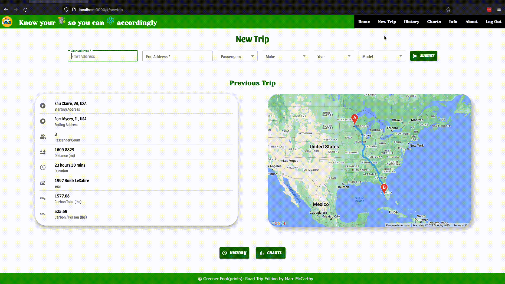

<div id="top"></div>

<!-- PROJECT SHIELDS -->

[![MIT License][license-shield]][license-url]
[![LinkedIn][linkedin-shield]][linkedin-url]
[![Gmail][gmail-shield]][gmail-url]

<!-- PROJECT LOGO -->

<br />
<div align="center">
  <a href="https://github.com/marc-mccarthy/greener-footprints">
    
  </a>

<!-- PROJECT DETAILS -->

  <h3 align="center">Greener Foot(prints)</h3>

  <p align="center">
    🍃 Travel situation emissions footprint calculator based on variables for how the user travels, with whom, and the route they want to go. Great for tracking your combustion footprint.
    <br />
    <a href="https://greener-footprints.herokuapp.com">View Demo</a>
    <br />
    <a href="https://github.com/marc-mccarthy/greener-footprints"><strong>Explore the docs »</strong></a>
    <br />
    <a href="https://github.com/marc-mccarthy/greener-footprints/issues">Report Bug</a>
    ·
    <a href="https://github.com/marc-mccarthy/greener-footprints/issues">Request Feature</a>
  </p>
</div>

<!-- TABLE OF CONTENTS -->

<details>
  <summary>Table of Contents</summary>
  <ol>
    <li>
      <a href="#about-the-project">About The Project</a>
      <ul>
        <li><a href="#built-with">Built With</a></li>
      </ul>
    </li>
    <li>
      <a href="#getting-started">Getting Started</a>
      <ul>
        <li><a href="#prerequisites">Prerequisites</a></li>
        <li><a href="#installation">Installation</a></li>
      </ul>
    </li>
    <li><a href="#usage">Usage</a></li>
    <li><a href="#roadmap">Roadmap</a></li>
    <li><a href="#contributing">Contributing</a></li>
    <li><a href="#license">License</a></li>
    <li><a href="#contact">Contact</a></li>
    <li><a href="#helpful">Helpful Tools & Resources</a></li>
    <li><a href="#acknowledgments">Acknowledgments</a></li>
  </ol>
</details>

<!-- ABOUT THE PROJECT -->

## About The Project



This is an exploration into understanding what really comes out of those tailpipes every time we get behind the wheel. What is that six inches of black smoke before it dissipates into thin air? How is it measured and does anyone have reliable information as to what the impact is?

These are questions beyond this scope, however, my goal is to help start this discovery by showing you a measurement we all understand; pounds. Carbon pounds for gasoline are measured after combustion, where each carbon atom attaches with two oxygen atoms. The oxygen is the heaviest weight of the pair and gives the emission more weight than prior to the burning. Simply, one gallon of gasoline weighs approximately 6.25 lbs while one gallon of the emission equivalents weighs approximately 19.3 lbs.

This app will allow you to see how much carbon is emitted from your specific vehicle with your provided trip route. It also will not hold you accountable for the emissions of your passengers! This is a simple way to understand the carbon footprint of your vehicle with trips and measurements we make on a daily basis!

<p align="right">(<a href="#top">back to top</a>)</p>

<!-- TECHNOLOGY USED -->

### Built With

-   [![React][react.js]][react-url]
-   [![Redux][redux.js]][redux-url]
-   [![Redux-Saga][redux-saga.js]][redux-saga-url]
-   [![PostgreSQL][postgresql]][postgresql-url]
-   [![Material-UI][material-ui]][material-ui-url]
-   [![Express][express.js]][express-url]
-   [![Node][node.js]][node-url]
-   [![Markdown][markdown]][markdown-url]
-   [![Chart.js][chart.js]][chart-url]
-   [![React-Router][react-router]][react-router-url]
-   [![Heroku][heroku]][heroku-url]
-   [![NPM][npm]][npm-url]

<p align="right">(<a href="#top">back to top</a>)</p>

<!-- GETTING STARTED & INSTALLING -->

## Getting Started

### Prerequisites

0. This project was tested using Firefox and Chromium browsers.
1. Setup a free (kinda) account on [Amazon Web Services](https://aws.amazon.com/).
2. Get a free (sorta) maps API key at [Google Maps Platform](https://developers.google.com/maps/apis-by-platform).
3. Get a free emissions API key at [Carbon Interface](https://www.carboninterface.com).
4. Clone the repo by HTTPS:

    ```sh
    git clone https://github.com/marc-mccarthy/greener-footprints.git
    ```
    or via SSH:
    ```sh
    git clone git@github.com:marc-mccarthy/greener-footprints.git
    ```
    or by CLI:
    ```sh
    git clone gh repo clone marc-mccarthy/greener-footprints
    ```

5. Enter all your credentials into your '.env' file:
    - AWS Information
    ```dotenv
    AWS_ACCESS_KEY_ID='ENTER YOUR AWS ACCESS KEY ID HERE'
    AWS_SECRET_ACCESS_KEY='ENTER YOUR AWS SECRET ACCESS KEY HERE'
    AWS_REGION='ENTER YOUR AWS REGION HERE'
    AWS_BUCKET_NAME='ENTER YOUR AWS BUCKET NAME HERE'
    ```
    - Google Maps Information
    ```dotenv
    REACT_APP_GOOGLE_MAPS_KEY='ENTER YOUR GOOGLE MAPS API KEY HERE'
    ```
    - Carbon Interface Information
    ```dotenv
    CARBON_INTERFACE_KEY='ENTER YOUR CARBON INTERFACE API KEY HERE'
    ```
    - Session Random Key
    ```dotenv
    SERVER_SESSION_SECRET='ENTER RANDOM STRING OVER 8 CHARS HERE`
    ```

### Installation

1. Install dependencies by running:
    ```sh
    npm install
    ```
2. Run the app with the commands:
    ```sh
    npm run server
    npm run client
    ```

<p align="right">(<a href="#top">back to top</a>)</p>

<!-- USAGE EXAMPLES -->

## Usage

- This application is designed to be used with on a desktop or laptop device.
- You can create a user and login to save your trips and vehicles.
- See and compare your carbon footprint over time.
- Hopefully gain a better understanding of the size of your carbon footprint.

<p align="right">(<a href="#top">back to top</a>)</p>

<!-- ROADMAP -->

## Roadmap

- [ ] Add Jest unit testing
- [ ] Compare emissions to different vehicles
- [ ] Add various types of travel
- [ ] Scale views for different viewports
- [ ] Add a mobile view
- [ ] Add dates to your travel
- [ ] Host on AWS or Dokku/Digital Ocean

See the [open issues](https://github.com/marc-mccarthy/greener-footprints/issues) for a full list of proposed features (and known issues).

<p align="right">(<a href="#top">back to top</a>)</p>

<!-- CONTRIBUTING -->

## Contributing

Contributions are what make this community such an amazing place to learn, inspire, and create. Any contributions you make are **greatly appreciated**.

If you have a suggestion that would make this better, please fork the repo and create a pull request. You can also simply open an issue with the tag "enhancement".
Don't forget to give the project a star! Thanks again!

1. Fork the Project
2. Create your Feature Branch (`git checkout -b feature/AmazingFeature`)
3. Commit your Changes (`git commit -m 'Add some AmazingFeature'`)
4. Push to the Branch (`git push origin feature/AmazingFeature`)
5. Open a Pull Request

<p align="right">(<a href="#top">back to top</a>)</p>

<!-- CONTACT -->

## Contact

Marc McCarthy - [LinkedIn](https://linkedin.com/in/the-marc-mccarthy) - [Gmail](mailto:marstheory20@gmail.com)

Project Link: [Greener Foot(prints)](https://github.com/marc-mccarthy/greener-footprints)

<p align="right">(<a href="#top">back to top</a>)</p>

<!-- HELPFUL TOOLS & RESOURCES -->

## Helpful

-   [Figma](https://www.figma.com)
-   [Amazon Web Services Documentation](https://docs.aws.amazon.com/index.html)
-   [Google Maps Platform Documentation](https://developers.google.com/maps/documentation/)
-   [Carbon Interface Documentation](https://docs.carboninterface.com/#/)
-   [README.md Composing](https://www.welcometothejungle.com/en/articles/btc-readme-documentation-best-practices)
-   [Stack Overflow](https://stackoverflow.com/)
-   [Material UI Documentation](https://mui.com/material-ui/getting-started/learn/)
-   [DB Designer](https://dbdesigner.net/)
-   [Flaticon](https://www.flaticon.com/)

<p align="right">(<a href="#top">back to top</a>)</p>

<!-- ACKNOWLEDGMENTS -->

## Acknowledgments

I'd like to firstly thank my wife, Jessica! She put on a few hats over my time at Prime and this project wouldn't have nearly the commitment without her. She's been a superhero mom! Also, my children Mila, Madden and Reya. They were my inspiration to choose this topic and explore it so heavily. Shout out to my Prime staff and my Dorian cohort as we battled through the trenches together. They have been a wonderful group to grow with and share ideas and knowledge. I'd like to also thank all of you in the open source community for your contributions to projects I explored and got ideas from. Lastly, my dogs Roscoe and Remy, as they kept my feet warm on the late nights of studying!

#### Credit for icons used:

- <a href="https://www.flaticon.com/free-icons/carbon-dioxide" title="carbon dioxide icons">Carbon dioxide icons created by wanicon - Flaticon</a>
- <a href="https://www.flaticon.com/free-icons/carbon-footprint" title="carbon footprint icons">Carbon footprint icons created by Freepik - Flaticon</a>
- <a href="https://www.flaticon.com/free-icons/co2" title="co2 icons">Co2 icons created by Freepik - Flaticon</a>

<p align="right">(<a href="#top">back to top</a>)</p>

<!-- LICENSE -->

## License

Distributed under the MIT License. See `LICENSE.txt` for more information.

<p align="right">(<a href="#top">back to top</a>)</p>

<!-- MARKDOWN LINKS & IMAGES -->
<!-- https://www.markdownguide.org/basic-syntax/#reference-style-links -->

[contributors-shield]: https://img.shields.io/github/contributors/othneildrew/Best-README-Template.svg?style=for-the-badge
[contributors-url]: https://github.com/othneildrew/Best-README-Template/graphs/contributors
[forks-shield]: https://img.shields.io/github/forks/othneildrew/Best-README-Template.svg?style=for-the-badge
[forks-url]: https://github.com/othneildrew/Best-README-Template/network/members
[stars-shield]: https://img.shields.io/github/stars/othneildrew/Best-README-Template.svg?style=for-the-badge
[stars-url]: https://github.com/othneildrew/Best-README-Template/stargazers
[issues-shield]: https://img.shields.io/github/issues/othneildrew/Best-README-Template.svg?style=for-the-badge
[issues-url]: https://github.com/othneildrew/Best-README-Template/issues
[license-shield]: https://img.shields.io/github/license/othneildrew/Best-README-Template.svg?style=for-the-badge
[license-url]: https://github.com/othneildrew/Best-README-Template/blob/master/LICENSE.txt
[linkedin-shield]: https://img.shields.io/badge/LinkedIn-0077B5?style=for-the-badge&logo=linkedin&logoColor=white
[linkedin-url]: https://linkedin.com/in/the-marc-mccarthy
[gmail-shield]: https://img.shields.io/badge/Gmail-D14836?style=for-the-badge&logo=gmail&logoColor=white
[gmail-url]: mailto:marstheory20@gmail.com
[product-screenshot]: images/screenshot.png
[react.js]: https://img.shields.io/badge/React-20232A?style=for-the-badge&logo=react&logoColor=61DAFB
[react-url]: https://reactjs.org/
[redux.js]: https://img.shields.io/badge/Redux-593D88?style=for-the-badge&logo=redux&logoColor=white
[redux-url]: https://redux.js.org/
[postgresql]: https://img.shields.io/badge/PostgreSQL-316192?style=for-the-badge&logo=postgresql&logoColor=white
[postgresql-url]: https://www.postgresql.org/
[redux-saga.js]: https://img.shields.io/badge/Redux%20saga-86D46B?style=for-the-badge&logo=redux%20saga&logoColor=999999
[redux-saga-url]: https://redux-saga.js.org/
[markdown]: https://img.shields.io/badge/Markdown-000000?style=for-the-badge&logo=markdown&logoColor=white
[markdown-url]: https://duckduckgo.com/?q=markdown&t=brave&ia=web
[material-ui]: https://img.shields.io/badge/Material%20UI-007FFF?style=for-the-badge&logo=mui&logoColor=white
[material-ui-url]: https://mui.com/
[heroku]: https://img.shields.io/badge/Heroku-430098?style=for-the-badge&logo=heroku&logoColor=white
[heroku-url]: https://heroku.com
[chart.js]: https://img.shields.io/badge/Chart.js-FF6384?style=for-the-badge&logo=chartdotjs&logoColor=white
[chart-url]: https://www.chartjs.org
[node.js]: https://img.shields.io/badge/Node.js-339933?style=for-the-badge&logo=nodedotjs&logoColor=white
[node-url]: https://nodejs.org/en/
[express.js]: https://img.shields.io/badge/Express.js-000000?style=for-the-badge&logo=express&logoColor=white
[express-url]: https://expressjs.com/
[npm]: https://img.shields.io/badge/npm-CB3837?style=for-the-badge&logo=npm&logoColor=white
[npm-url]: https://www.npmjs.com
[react-router]: https://img.shields.io/badge/React_Router-CA4245?style=for-the-badge&logo=react-router&logoColor=white
[react-router-url]: https://react-router.js.org/